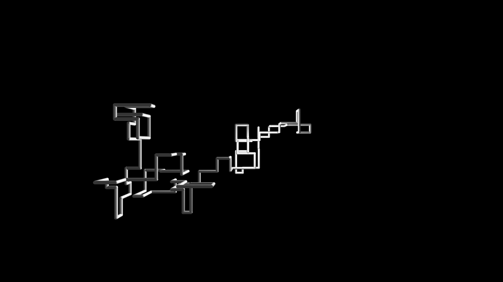

# Nature of Code Experiments

[ [Project Page](https://jackbdu.com/nature-of-code-experiments/) \| [GitHub Repository](https://github.com/jackbdu/nature-of-code-experiments/) \| [About Me](https://jackbdu.com/about/) ]

This repository showcases experiments I developed in C++ using openFrameworks for [_The Nature of Code_ course](https://github.com/nature-of-code/noc-syllabus-s25) at NYU, taught by [Dan Shiffman](https://thecodingtrain.com/about). The course was supplemented by [_The Nature of Code_ book](https://natureofcode.com/) and its accompanying [video tutorials](https://thecodingtrain.com/tracks/the-nature-of-code-2).

If you would like to run the openFrameworks sketches, see [instructions](#how-to-run-openframeworks-sketches) near the end of the page.

## Experiment 01: Brushstroke

[ [Source Code](https://github.com/jackbdu/nature-of-code-experiments/tree/main/01-brushstroke/src) ]

|  |  |  |
| --------------------------------------------------------------------------------- | ------------------------------------------------------------------------------------------ | ---------------------------------------------------------------------------------------------- |
| [01/28/2025](https://www.instagram.com/p/DFZj0vcuX0-/)                            | [01/29/2025](https://www.instagram.com/p/DFcIGe-xZjq/)                                     | [01/30/2025](https://www.instagram.com/p/DFeanW4Mh87/)                                         |

## Experiment 02: Pipes

[ [Source Code](https://github.com/jackbdu/nature-of-code-experiments/tree/main/02-pipes/src) ]

|  |  |  |
| ---------------------------------------------------------------------------------- | ------------------------------------------------------------------------------------------- | ------------------------------------------------------------------------------------------- |
| [01/31/2025](https://www.instagram.com/p/DFjJCMAsusW/)                             | [02/01/2025](https://www.instagram.com/p/DFk99tixlxG/)                                      | [02/02/2025](https://www.instagram.com/p/DFmW8UEssqc/)                                      |

## How to Run openFrameworks Sketches

1. Download openFrameworks v0.12.0 for your desired platform (e.g. `osx` for macOS) from the [openFrameworks download page](https://openframeworks.cc/download/) and unzip it. You should see a folder like `of_v0.12.0_platform_release/` (e.g. `of_v0.12.0_osx_release/` for macOS).
2. [Download my experiments repository](https://github.com/jackbdu/computer-graphics/archive/refs/heads/main.zip), unzip it, and place the extracted folder (`nature-of-code-experiments-main/`) into the `of_v0.12.0_platform_release/apps/` folder.
3. Use the projectGenerator app in `of_v0.12.0_platform_release/projectGenerator/` to update each sketch folder (e.g. `01_brushstroke/`) before compiling and running it in your preferred IDE.

_For additional guides, you can refer to the [openFrameworks learning page](https://openframeworks.cc/learning/)._
